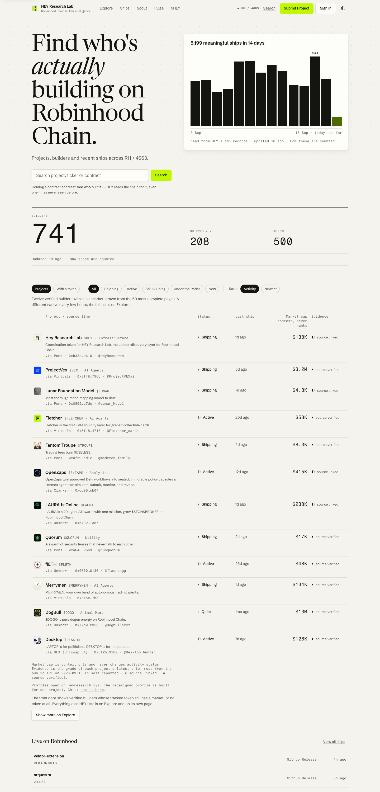

# HEY Research Lab, a redesign proposal

A front-end proposal for [heyresearch.xyz](https://heyresearch.xyz), built as a static prototype from HEY's own copy and public API. Seven pages, one token file, one stylesheet, no build step. Free to use, adapt, or ignore.

**[Before and after](https://yonkoo11.github.io/hey-redesign/docs/compare.html)** · **[Open the prototype](https://yonkoo11.github.io/hey-redesign/site/)**



*Home. A serif headline beside HEY's own 14-day ships chart, the three counters set large, and the twelve front-door projects as a ledger with a source line under every number.*

## What changed

- Projects sit in a ledger: hairline rows instead of cards, with the source of each number written beneath it.
- The Build Momentum score opens each profile, with its five weighted parts on ruled rows. On the live site it sits in a sidebar below the fold.
- The home page starts with a chart of the last 14 days of meaningful ships, read from HEY's own records (5,199 ships, peak 541).
- Explore is live. Search, status, type, narrative, launchpad, market cap and sort call the public API; the result line says where the rows came from, and the filters are written to the URL.
- Colours come from HEY's icon (cream, ink, lime) rather than the navy of the current site. Dark mode is a warm ramp, not an inversion.

## What did not change

HEY's copy, scoring rules, statuses, badges, evidence grades and mark. Every sentence and number on the pages is theirs. Seven em dashes inside their sentences became commas or full stops; no words changed.

## Open it locally

```
git clone https://github.com/Yonkoo11/hey-redesign
cd hey-redesign
python3 -m http.server 8080
```

Then open http://localhost:8080/site/. Fonts are self-hosted, so the pages also open directly from the file system.

## Verify it yourself

Run these from the repo root. The expected output follows each command; each was run before it was written down.

```
grep -cE "#[0-9a-fA-F]{6}" site/styles.css site/index.html site/project.html
# site/styles.css:0
# site/index.html:0
# site/project.html:0        colours live only in site/tokens.css

grep -c "border-radius: [0-9]" site/styles.css
# 0                          radius comes from four tokens

grep -c "transition: all" site/styles.css
# 0

ls site/fonts | wc -l && du -sh site/fonts
# 4
# 260K    site/fonts

curl -s -H "Origin: http://localhost:8080" -I "https://heyresearch.xyz/api/projects?limit=1" | grep -i access-control-allow-origin
# access-control-allow-origin: *      this is why Explore can run in the browser
```

## Where the numbers come from

| Number | Source |
|---|---|
| Copy, statuses, badges, counters, the twelve front-door projects | heyresearch.xyz as captured on 16 September 2026 |
| Evidence grade per project on Home | `/api/ships?project=<slug>`, the latest ship's verification |
| Chit's momentum and its five parts | heyresearch.xyz/project/chit, `/api/projects/chit` |
| 14-day ships chart | the daily values behind the chart on the live home page; they sum to HEY's own 5,199 |
| Explore rows | `/api/projects` live, with `site/data/projects.json` (192 projects, 16 September) as a fallback when the API does not answer |

Market caps drift by the hour. The static pages keep the morning capture; Explore shows whatever the API returns now.

## Limitations

| Capability | Status |
|---|---|
| Redesigned project profile | Built for one project, Chit. Other rows open the live profiles on heyresearch.xyz. |
| Ships, Pulse, Radar, Signals, Builders, Bounties, Submit and a few smaller pages | Not built. Their links carry `data-prototype="missing"`. |
| Chart bars linking to a day | Not possible; the API has no per-day filter, so bars open the newest-first list. |
| Browser coverage | Chrome only, at 400, 720, 1024 and 1440 px, light and dark. Not tested in Safari or Firefox. |
| Accessibility | Keyboard order and focus rings checked; no screen-reader pass. |
| Review by HEY | None yet. |

## Port

`site/tokens.css` is a plain CSS custom-property file in three tiers (base scale, meaning, component). It maps onto a Tailwind `@theme` block one for one. The classes in `site/styles.css` are documented in `DESIGN_SYSTEM.md`, and `brand.json` carries the colours and fonts for anything downstream.

## Repository layout

```
site/            the prototype: seven pages, tokens.css, styles.css, app.js, fonts, data
docs/            the before/after page and its images
DESIGN_SYSTEM.md tokens, primitives, and the rules behind them
brand.json       colours, fonts, radii
```

## Credits

Newsreader, Schibsted Grotesk and Fragment Mono, all under the SIL Open Font License, self-hosted as WOFF2. Everything else on the pages belongs to HEY Research Lab. MIT licence on the code.
